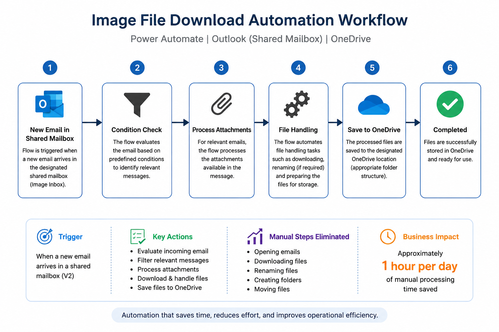

# Image File Download Automation

## Project Overview

An automated file-processing solution designed to reduce repetitive manual work involved in handling files received through an Image Inbox.

The solution uses Microsoft Power Automate to monitor a shared mailbox, process relevant incoming files, and save them to a designated OneDrive location.

---

## Business Problem

The Image Inbox required team members to manually process incoming files before they could be stored in the appropriate location.

### Before

**Open Email → Download Files → Rename Files → Create Folders → Move Files**

This involved repetitive manual actions and consumed processing time on a daily basis.

---

## Solution

A Power Automate workflow was developed to automate the file-handling process.

## Automation Workflow

The workflow:

1. Detects new emails arriving in the shared mailbox
2. Evaluates the incoming message
3. Processes the relevant files
4. Automates file handling
5. Saves the processed files to the designated OneDrive location

---

## Business Impact

The automation reduced several repetitive manual activities, including:

- Opening emails
- Downloading files
- Renaming files
- Creating folders
- Moving files

### Measured Result

**Approximately 1 hour of manual processing time saved per day.**

This allowed the team to spend more time on higher-value operational activities instead of repetitive file handling.

---

## My Contribution

I independently handled the automation development and implementation, including:

- Identified the repetitive file-handling process
- Designed the automation approach
- Built the Power Automate workflow
- Configured the shared mailbox trigger
- Implemented conditions and file-processing logic
- Configured OneDrive file storage
- Tested and troubleshot the workflow
- Implemented the solution in the operational process

---

## Technology Stack

- Microsoft Power Automate
- Outlook / Shared Mailbox
- OneDrive
- Workflow Automation
- File Processing

---

## Project Status

**Completed and implemented in an organizational environment.**
